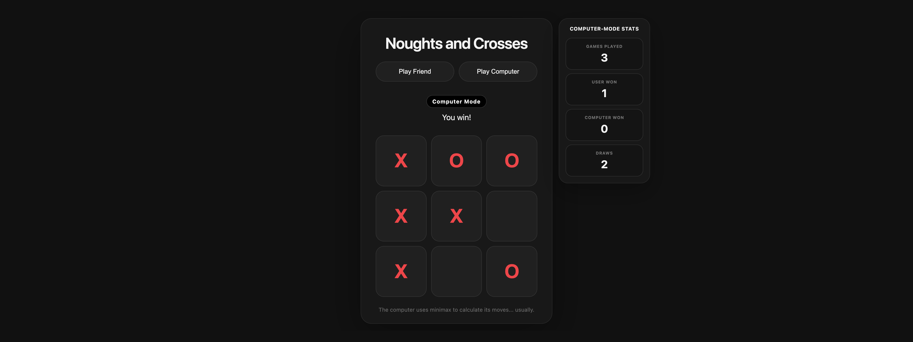
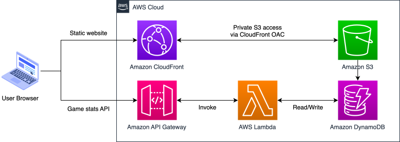

# ⭕ Noughts and Crosses ❌

A browser-based noughts and crosses (tic tac toe) game deployed to AWS with Terraform. The app is deployed as a static website with secure public access and a lightweight backend for storing game statistics.

**Features**

- Play against another player on the same device
- Play against the computer
- Computer mode uses minimax-based move selection
- Game statistics are tracked through a backend API
- Infrastructure is fully deployed with Terraform

**Live deployment** 

- <https://d2mrwywexba4ua.cloudfront.net>
- Figure 1 shows the deployed game running in the browser

<p align="center">
  
  <br>
  <em>Figure 1: Screenshot of the live deployment.</em>
</p>

## Architecture

Users access the game through CloudFront, which serves the static frontend from a private S3 bucket. The bucket is not publicly accessible directly, access is restricted through Origin Access Control.

Game statistics are handled separately by a small serverless backend. The frontend sends requests to API Gateway, which invokes a Lambda function. The function reads and updates statistics stored in DynamoDB.

An overview of the AWS services used is shown in Figure 2.

<p align="center">
  
  <br>
  <em>Figure 2: Architecture diagram.</em>
</p>

## Deployment procedure

Deployment is automated through the `deploy.sh` script.

The script:

- Initializes and applies the Terraform configuration
- Reads Terraform outputs such as the API URL, frontend bucket name, CloudFront distribution ID, and CloudFront URL
- Generates `index.html` from `index_template.html`
- Replaces the `__API_BASE_URL__` placeholder with the deployed API Gateway URL
- Uploads the generated frontend file to the S3 bucket
- Creates a CloudFront invalidation so the latest version is served

Prerequisites:

- Terraform
- AWS CLI
- Configured AWS credentials

To deploy the project from the repository root:

```bash
./deploy.sh
